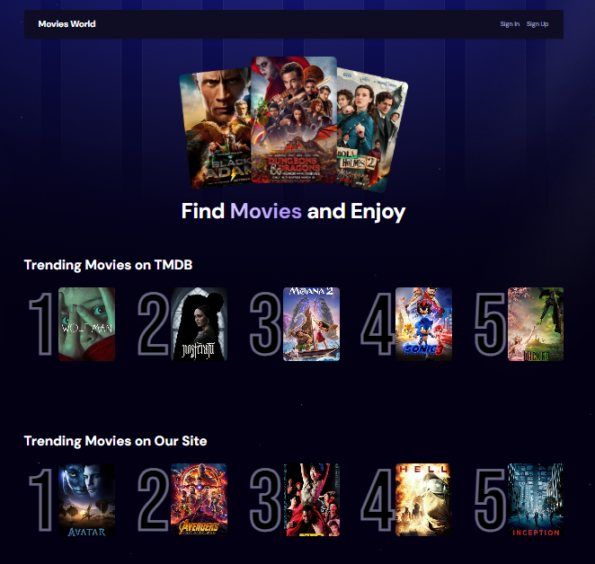
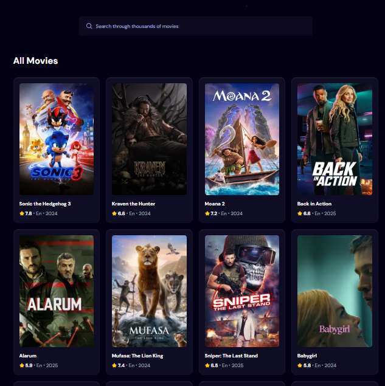
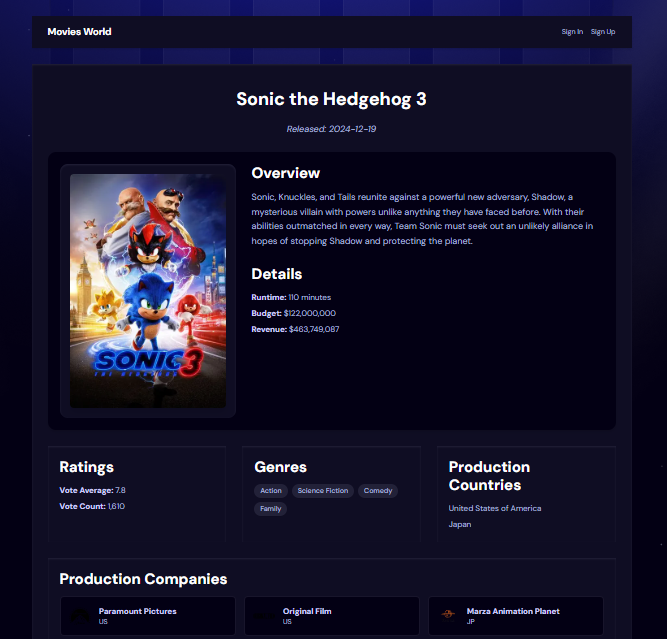

# 🎬 MovieFlix

MovieFlix is a modern movie discovery application built with **Next.js 15** and **React 19**. It leverages the latest features such as **server components** and **server actions** for an optimized experience. Users can explore trending movies, search for films, view details, and save their favorites. Authentication is powered by **Clerk**, and searches are stored using **Appwrite**.

## 🚀 Features

- **🔥 Trending Movies** – Fetches trending movies from **TMDB API** and displays them dynamically.
- **🔍 Search Functionality** – Users can search for movies, with results stored in **Appwrite** to track trending searches.
- **📜 Pagination Support** – Browse movies across multiple pages with smooth navigation.
- **📌 Movie Details** – Click on a movie to view comprehensive details, including ratings, budget, and production info.
- **❤️ Favorite Movies** – Logged-in users can add movies to their favorites list (stored in local storage).
- **🛡️ Authentication** – Uses **Clerk** for user authentication (sign-up, login, and session handling).
- **⚡ Performance Optimizations** – Implements **use-debounce** to optimize search requests and minimize API costs.
- **🎨 Stylish UI** – Designed with **Tailwind CSS** and **React Toastify** for alerts and notifications.

## 🏗️ Tech Stack

- **Frontend:** Next.js 15 (App Router, Server Components, Server Actions), React 19
- **Styling:** Tailwind CSS
- **Authentication:** Clerk
- **Database:** Appwrite (for search trends)
- **API:** TMDB API (Movie Data)
- **Responsive UI**: Fully optimized for desktop and mobile devices
- **State Management:** LocalStorage (for favorites)
- **Performance Enhancements:** use-debounce for efficient searching
- **Notifications:** React Toastify for interactive alerts

## 📂 Project Structure

```
📦 MovieFlix
├── 📂 app
│   ├── 📂 (auth)       # Authentication pages
│   ├── 📂 api          # API routes for backend logic
│   ├── 📂 favorites    # User favorite movies feature
│   ├── 📂 movie        # Movie details and related pages
│   ├── 📜 page.jsx     # Homepage with trending movies & search
│   ├── 📜 appwrite.js  # Appwrite service configurations
│   ├── 📜 global.css   # Global styles
│   ├── 📜 layout.jsx   # Main layout structure
├── 📂 components       # Reusable UI components
├── 📂 services         # API service functions for TMDB & Appwrite
├── 📂 context          # Context for movies state
└── 📜 middleware.js    # Middleware configurations
└── 📜 README.md        # Project documentation
```

## 🌍 Demo

Check out the live demo of the app: [MovieFlix](https://movie-flix-mu-blue.vercel.app)

## 📸 Screenshots

### Home Page




### Movie Details Page



## 📦 Installation & Setup

1. Clone the repository and navigate to the project directory:

   ```sh
   git clone <repository-url>
   cd MovieFlix
   ```

2. Install dependencies:
   ```sh
   npm install
   ```
3. Rename `env.local.txt` file to `.env.local` and add the necessary environment variables for [**TMDB API**](https://developer.themoviedb.org/reference/discover-movie), [**Clerk**](https://clerk.com), and [**Appwrite**](https://appwrite.io).
4. Run the development server:
   ```sh
   npm run dev
   ```
5. Open `http://localhost:3000` in your browser.

## 🌟 Contributing

Contributions are welcome! Feel free to fork the repo, submit issues, or create pull requests.

## 📜 License

This project is licensed under the [MIT License](./LICENSE).
